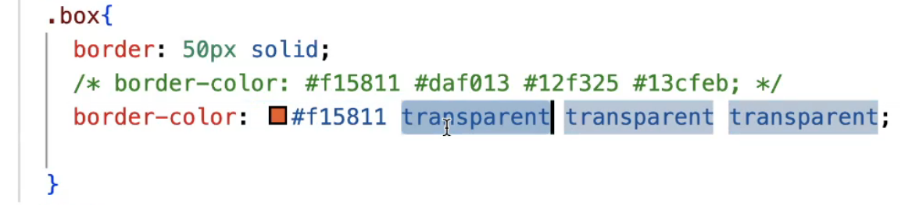
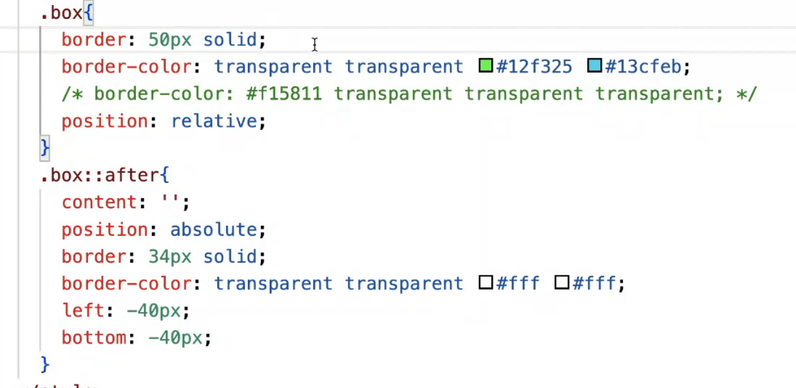
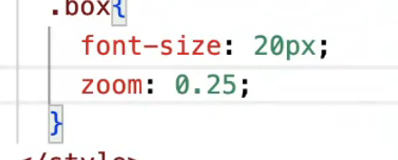

# 1. 说说你对css盒模型的理解
1. 是什么？
浏览器在页面布局时，将所有的元素表示为一个个矩形盒子，每一个盒子包含四个部分：content, padding, border, margin

2. 标准盒模型
盒子总宽度：width + padding + border + margin

3. 怪异盒模型(IE)
盒子总宽度: width + margin

# 2. css中的选择器有哪些？说说优先级
1. id选择器
2. 类名选择器
3. 标签选择器
4. 后代选择器
5. 子级选择器
6. 相邻兄弟选择器
7. 群组选择器
8. 属性选择器
9. 伪元素选择器
10. 伪类选择器

!important > 内联 > id选择器 > 类名选择器 > 标签选择器

  - 常见的伪类包括：
    :hover - 鼠标悬停状态
    :active - 激活状态
    :visited - 已访问链接状态
    :focus - 获得焦点状态
    :first-child - 第一个子元素
    :nth-child() - 指定位置的子元素
  - 常见的伪元素包括：
    ::before - 在元素内容之前插入内容
    ::after - 在元素内容之后插入内容
    ::first-line - 选择元素的第一行
    ::first-letter - 选择元素的第一个字母

# 3. 说说css中的单位有哪些？
1. px : 像素单位，屏幕上的发光点
2. rem : 相对单位，相对于根字体大小
3. em : 相对单位，用于字体上会继承父容器的字体大小，用在它处，是相对于当前容器自己的字体大小来定的
4. vw/vh : 相对单位，相对于窗口宽高比
5. % : 相对单位，相对于父容器

# 4. 说说设备像素，css像素，设备独立像素，dpr，ppi之间的区别？
1. pc端 1px == 1个物理像素
2. 页面缩放比为1:1=时， 1px == 1个物理像素

设备像素 === 物理像素
css像素 === 1px
设备独立像素 === 分辨率           
dpr(设备像素比) === 设备像素 / 设备独立像素
ppi === 像素的密度

# 5. css中有哪些方式可以隐藏页面元素？区别是什么？
1. display: none        脱离文档流   无法响应事件     回流重绘
2. visibility: hidden   占据文档流   无法响应事件     重绘
3. opacity: 0           占据文档流   响应事件        重绘 || 不重绘(当使用animation时，animation会触发GPU的加速模式，便不会产生重绘)
4. position: absolute(绝对定位，相对于外层具有定位属性的容器；相对定位是相对于自身原本所在的位置进行定位)   脱离文档流   无法响应事件     回流重绘
5. clip-path: circle(0%) 占据文档流   无法响应事件    重绘

# 6. 谈谈你对BFC的理解
- 是什么
  块级格式化上下文，是页面中一个渲染区域，有一套属于自己的渲染规则

- 渲染规则
  1. BFC容器在计算高度时，浮动元素的高度也会计算在内
  2. BFC容器内的子元素的margin-top不会和BfC这个父容器发成重叠
  3. 遵照从上往下从左往右的布局排列（别的容器布局也这样）

- 触发条件
  1. overflow: 不为visible
  2. float
  3. display: inline-block || inline-flex  ||  inline-grid || inline-table  || flex  || grid || table-xxx
  4. position: absolute || fixed

- 应用
  清除浮动

# 7. 水平垂直居中的方式有哪些？ !!!!!
1. position: absolute  + translate || margin负值（已知宽高）
2. flex 主轴居中，交叉轴居中(justify-content:center;align-items:center;)
3. grid 主轴居中，交叉轴居中
4. table:  text-align  + vertical-align  (子容器不能是块级)
5. margin(已知宽高)

# 8. 三栏布局怎么实现？
- 两栏布局：
1. flex
2. grid
3. float + margin-left

- 三栏布局:
1. flex
2. grid
3. 左右先加载内容后加载：float + margin
4. 圣杯布局：float + margin负值 + position:relative
5. 双飞翼布局：float + margin负值

# 9. 说说flexbox
- 是什么
  是一种布局方式，可以简便完整响应式的实现页面布局，容器中默认存在两条轴，主轴，交叉轴，默认x轴为主轴，可以用flex-direction来修改主轴的方向

- 特征
  1. 可以控制子元素在主轴上的对齐方式
  2. 可以控制子元素在交叉轴上的对齐方式
  3. 可以控制子元素 缩放比例， 排列顺序

- 应用场景
  1. 多栏布局
  2. 居中

# 10. css3新增了那些属性？
1. 选择器： 属性选择器，伪类选择器(nth-child,first-child,end-child)
2. box-shadow
3. 裁剪： background-clip
4. transition  (过渡动画)
5. transform  (平移，旋转，缩放，倾斜)
6. animation (动画)
7. 渐变色

# 11. css3中常见的动画有哪些？怎么实现？
1. transition ： 当其他属性值发生变更时，控制该值变更所花费的时间以及变更曲线
2. transform ： 用于做容器的旋转，平移，缩放，倾斜等动画
3. animation ：控制容器动画的关键帧

# 12. 说说回流重绘 （重排重绘）
- 是什么
  回流：浏览器渲染页面之前需要对结构进行布局计算
  重绘：将已经计算好布局的容器绘制出来

- 触发
  回流：页面上有容器的几何属性发生变更
  重绘：容器非几何属性变更 （字体，颜色）

  回流必定重绘

# 13. 什么是响应式？   
- 是什么  
跟随用户设备尺寸的变化，页面实现自动的适配

- 实现方案：
1. flex (适用于某个容器内的响应式)
2. %  (常适用于外层大容器)    ------   继承父容器的大小
3. rem + 媒体查询  （可用于任何地方）  --------  虽然也要写多个媒体查询，但 是每个媒体查询中的代码量少
4. 媒体查询 （可用于任何地方）  ---------  代码量大
5. vw/vh  (常适用于外层大容器)   -------  相对window大小

# 14. 视差滚动效果如何实现？
- 是什么 
多层背景以不同的速度进行移动，实现视觉上的落差

- 实现： 
1. background-attachment: fixed; 
2. perspective + translateZ

# 15. css画一个三角形
- 实心三角

- 空心三角

# 16. 如何显示一个小于10px的文字
（新版本的谷歌可以支持任意像素的文字的，但是不是所有浏览器都有这个功能）
1. zoom（通过变焦来实现）

2. transform: scale(xxx);（缩放多少倍）