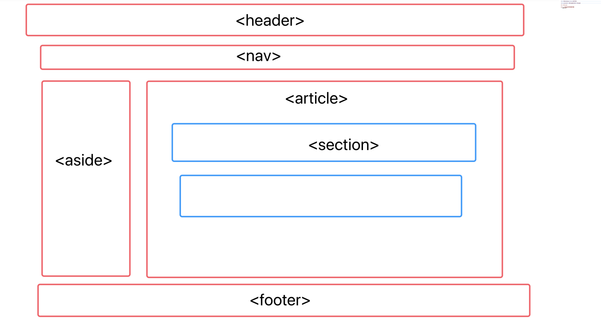
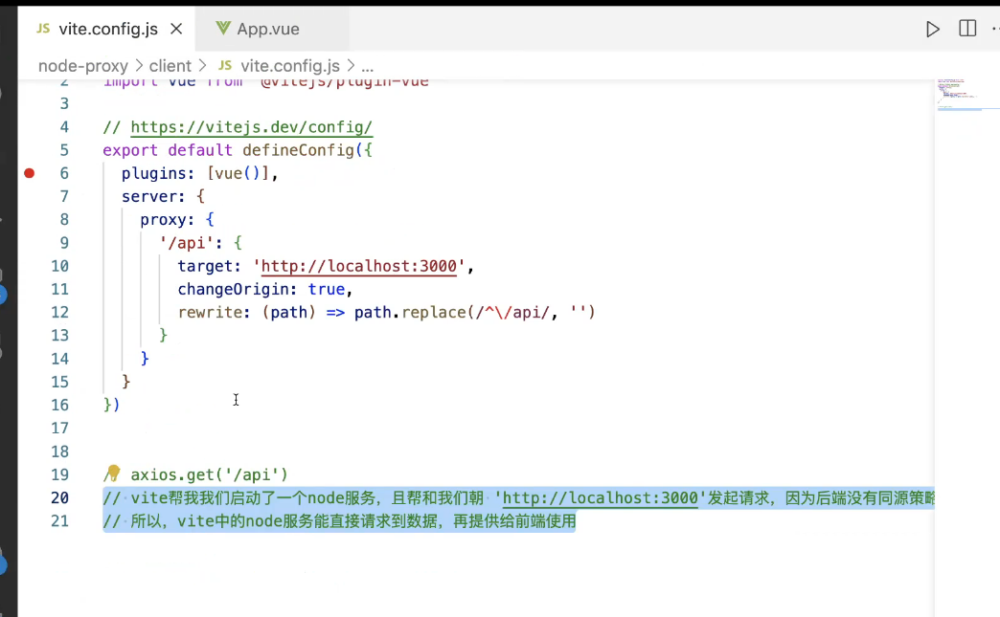

# 自我介绍
姓名 + 学校 + 做过什么 + 有过什么成绩 + 为什么能胜任（ai）

# 1. 数组上的方法，在js中的意义
var a = []
a.push()
a.pop()

- 手写new函数
function myNew(Fn){ // Fn是构造函数
    let obj = {}
    obj.__proto__ = Fn.prototype
    Fn.call(obj)
    retun obj
}

1. 创建对象字面量在V8的执行过程中，相当于new了一个构造函数，通常我们不直接去new一个构造函数，因为不够简洁直观
2. 因为a相当于new Array()得到的，那么a的隐式原型等于构造函数的显示原型，V8在查找属性的时候会现在对象上查找，找不到就会顺着对象的原型往上查找

# 2. Promise 有几种状态？可以直接改变吗？
- 代码演示
function a() {
    return new Promise(function(resolve, reject){
        resolve('ok')
        reject('error')
    })
}
a()
.then((res) => {
    console.log(res)
})
.catch((err) => {
    console.log(err)
})
//结果：输出ok

- 手写Promise函数
function myPromise(fn){
    this.state = 'pending'  // 代表初始状态（还未生效）
    this.value = null
    this.reason = null

    const resolve = (value) =>{
        if(this.state = 'pending'){
            this.value = value
            this.state = 'fulfilled'    // 成功执行（执行完毕）
        }
    }
    const reject = (reason) => {
        if(this.state = 'pending'){
            this.reason = reason
            this.state = 'rejected'
        }
    }
}
手写Promise身上的方法：https://juejin.cn/post/7270403438202110010

1. 3种：Pending Fufilled Rejected
    Promise中状态变更后无法再变回来了，因为if语句的存在

- 红绿灯算法（Promise进阶）
function red(){
    console.log('红灯亮');
}
function yellow(){
    console.log('黄灯亮');
}
function green(){
    console.log('绿灯亮');
}
function light(cb, wait) {
    return new Promise((resolve) => {
        setTimeout(() => {
            cb()
            resolve()
        }, wait)
    })
}
function lightSteep(){
    Promise.resolve().then(() => {
        return light(red, 3000)
    }).then(()=>{
        return light(yellow, 2000)
    }).then(()=>{
        return light(green, 1000)
    }).finally(()=>{    // 这边用.then也是一样的，但习惯用finally
        return lightSteep() 
    })
}
lightSteep()

# 3. 输出结果
- 示例
const obj1 = {a:1}
const obj2 = {a:2}
console.log(obj1 == obj2)   // false(虽然值相等，但引用地址不等)
console.log(obj1 === obj2)  // false(虽然类型和值都相等，但引用地址不等)

- 原理
== 会发生隐式类型转换
obj1 ==> '[object Object]'
obj2 ==> '[object Object]'
所以任意两个对象，不管长啥样，只要用==来判断，他们的值都会被判断为相等，但他们引用地址不相等
=== 先判断类型是否相等，再看引用地址，最后看值（都是先看引用地址再看值）

# 4. 聊聊你对语义化的理解
- 语义化有哪些：header nav aside article section footer

- 为什么要有语义化标签
    - 优点：可读性好，搜素引擎优化，更好地支持各个终端

# 5. 斐波那契
- 递归
function fb(){
    if(n === 1 || n ===2) return 1
    return fb(n - 1) + fb(n - 2) 
}

- 动态规划
function fb(){
    let list = [1,1]
    for(let i = 2; i < n; i++){
        list[i] = list[i - 1] + list[i - 2]
    }
    return list[n - 1]
}
fb(10)

# 6. 用过什么AI工具
1. chatGpt  (刻意练习prompt技巧，生成一些简单的前端网页，学习)
2. copilot   (提升开发效率)
3. 最近在学习transform、openai技能，对大模型很感兴趣，也在学习LangChain/LLM
4. 自己准备一个大模型，介绍你对他的理解

# 7. 讲一讲HTTP的三次握手和四次挥手
- 三次握手是TCP协议建立连接产生的
    1. 客户端发送连接请求到服务端，客户端状态进入SYN-SENT状态
    2. 服务端收到请求连接报文后，返回一个应答(包含ACK序号)，进入SYN-RCVD状态
    3. 客户端接受到了统一连接的应答后，还需向服务端发送一个确认收到的报文，再进入ESTABLISHED状态

    - 为什么是三次握手，两次行不行
        不行，假设客户端给服务端发送了一个建立连接请求A，但是因为网络环境差，这个请求A超时了，那么TCP会启动超时重传机制，在发送一个新的建立连接请求B，服务端接受到请求B后应答，如果此时完成了建立连接的话，当客户端和服务端通信完成后，变释放了连接，双方都进入Closed状态。假设此时A请求有抵达服务端，那么服务端会认为客户端又要建立新的连接从而应答该请求并进入ESTABLISHED，而此时客户端是Closed状态的，那么服务端就会一直等待，造成资源浪费。

- 四次挥手
1. 客户端A认为数据发送完成后，向服务端B发送释放连接请求
2. B收到释放连接请求后，返回一个ACK报文，并进入CLOSE_WAIT状态，此时不在接受A发送的数据，但是B仍然可以发送数据给A
3. B如果此时还有没发完的数据，就会继续发送，发完后向A发送释放连接的请求，B进入到LAST-ACK状态
4. A收到释放连接的请求，向B发送应答，并进入CLOSED状态，B接收到应答后也进入CLOSED状态

# 8. 说一说跨域
https://192.168.31.45:8080/user
协议号 ：域名（ip地址） ：端口号 / 路径

- 同源策略
    协议号-域名-端口号 都相同的地址，浏览器才认为是同源

- 跨域
    后端返回给浏览器的数据会被浏览器的同源策略给拦截下来

- 同源策略的目的是数据安全

## 解决跨域（开发阶段号调试）
1. JSONP —— 借助script标签上的src属性不收同源策略的影响这一机制，来实现跨域
    1. ajax请求收同源策略的影响,但是<script>上的src属性不受同源策略的影响,且该属性也会导致浏览器发送一个请求
        1. 借助script标签的src属性给后端发送一个请求,且携带一个参数'callback'
        2. 前端在window对象上添加了一个callback函数
        3. 后端接收到这个参数'callback'后，将要返回给前端的数据data和这个参数'callback'进行拼接，成'callback(data)'，并返回
        4. 因为window上已经有callback函数，后端又返回来一个形如'callback(data)'的字符串，所以浏览器会自动执行这个字符串，即执行callback(data)
    2. 缺点：
        1. 必须要后端配合
        2. 只能用于get请求

2. Cors(Cross-Origin Resource Sharing) —— 通过设置响应头来高数浏览器不要拒绝后端的相应
    在响应头里设置白名单
    - 后端代码（用node写的后端代码）
    const http = require('http');
    const server = http.createServer((req, res) => {
    //跨域是浏览器不接受后端的响应
    //想个办法,让浏览器不得接受
    res.writeHead(200, {
    //'Access-Control-Allow-Origin':'*' //白名单
    'Access-Control-Allow-Origin': 'http://127.0.0.1:5500' //白名单
    })
    let data = {
    msg: "hello cors"
    res.end(JSON.stringify(data))// 向前端返回数据
    server. listen(3000, () => {
    console. log('listening on port 3000');

3. node代理(vite  只在开发阶段生效，因为项目上线后，vite会被剔除掉)
原理：自己写一个后端，通过自己的后端向该后端请求数据，再将数据返回给前端（自己的后端传数据给前端也需要跨域）

4. nginx代理(原理类似cors，也是配置白名单)(生产环境下常用)

5. domain(在iframe中，当父级页面和子级页面的子域不同时，通过设置document.domain='xxx'来将xxx定位基础域，从而实现跨域)

6. postMessage(在iframe中，)